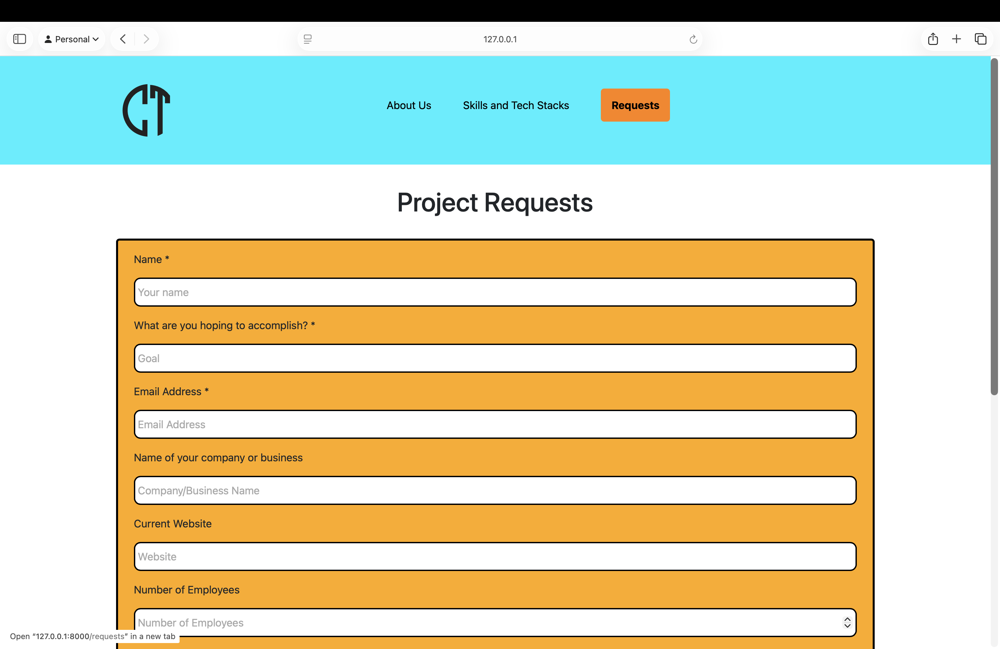

# CutlerTech Business Website

This is the Laravel project source code for the CutlerTech website.

## Prerequisites

This website runs on Laravel 12, which requires using at least version 8.2 of PHP and at least version 2.2 of Composer.  Make sure to install PHP and Composer with these versions or later before installing and setting up this project.  

## Local Setup Instructions for Development

1. Clone the repository and cd into the repository folder.
```bash
git clone git@github.com:CutlerTech/cutler-tech.git
cd cutler-tech
```
2. Install the composer dependencies.
```bash
composer install
```
3. Copy the .env.example file to be the .env file.
```bash
cp .env.example .env
```
4. Generate the Laravel application key.
```bash
php artisan key:generate
```
5. Create a MySQL database called cutler_tech.
```sql
CREATE DATABASE IF NOT EXISTS cutler_tech;
```
6. Create a database user with permissions for the cutler_tech database and save those credentials to the DB_USERNAME and DB_PASSWORD environment variables in the .env file.
```sql
CREATE USER 'new_user'@'localhost' IDENTIFIED BY 'your_password';
GRANT ALL PRIVILEGES ON cutler_tech.* TO 'new_user'@'localhost';
```
7. Run database migrations.
```bash
php artisan migrate
```
8. (Optional) Install npm dependencies.
```bash
npm install
```
9. Run the Laravel application server.
```bash
php artisan server
```

## Screenshots

### Home Screen


### About Screen


### Skills Screen


### Requests Screen



### Projects Screen


### Pricing Screen


## Database Design

### Requests

- ID: bigint unsigned and primary key
- Name: varchar(255)
- Goal: text
- Email: varchar(255)
- Company Name (company_name): varchar(255)
- Website: varchar(255)
- Employees: int
- Location: varchar(255)
- Phone: varchar(255)
- Challenge: text
- Comments: text
- Status: enum('pending','in_progress','completed','cancelled')
- Created At (created_at): timestamp
- Updated At (updated_at): timestamp

### Notifications

- ID: char(36) and primary key
- Type: varchar(255)
- Notifiable Type (notifiable_type): varchar(255) and composite
- Notifiable ID (notifiable_id): bigint unsigned
- Data: text
- Read At (read_at): timestamp
- Created At (created_at): timestamp
- Updated At (updated_at): timestamp

### Users

- ID: bigint unsigned and primary key
- Name: varchar(255)
- Email: varchar(255) and unique
- Email Verified At (email_verified_at): timestamp
- Password: varchar(255)
- Remember Token (remember_token) varchar(100)
- Is Admin (is_admin) tinyint(1)
- Created At (created_at): timestamp
- Updated At (updated_at): timestamp

## RESTful Endpoints

| Name                                    | Method | Path                                      | Middleware        | Route Name                  | Controller/Action                          |
| --------------------------------------- | ------ | ----------------------------------------- | ----------------- | --------------------------- | ------------------------------------------ |
| Retrieve home page                      | GET    | /                                         | N/A               | home                        | N/A                                        |
| Retrieve about page                     | GET    | /about                                    | N/A               | about                       | N/A                                        |
| Retrieve skills page                    | GET    | /skills                                   | N/A               | skills                      | N/A                                        |
| Retrieve projects page                  | GET    | /projects                                 | N/A               | projects                    | N/A                                        |
| Retrieve pricing page                   | GET    | /pricing                                  | N/A               | pricing                     | N/A                                        |
| Retrieve requests page                  | GET    | /requests                                 | N/A               | requests.create             | RequestController - create                 |
| Create request member                   | POST   | /requests                                 | N/A               | requests.store              | RequestController - store                  |
| Retrieve login page                     | GET    | /login                                    | N/A               | login                       | AuthController - showLogin                 |
| Create user session                     | POST   | /login                                    | N/A               | login.post                  | AuthController - login                     |
| Retrieve register page                  | GET    | /register                                 | N/A               | register                    | AuthController - showRegister              |
| Create user member                      | POST   | /register                                 | N/A               | register.post               | AuthController - register                  |
| Delete user session                     | POST   | /logout                                   | N/A               | logout                      | AuthController - logout                    |
| Retrieve dashboard page                 | GET    | /dashboard                                | Auth, Admin       | dashboard                   | DashboardController - index                |
| Retrieve requests collection            | GET    | /admin/requests                           | Auth, Admin       | requests.index              | RequestController - index                  |
| Retrieve request member                 | GET    | /admin/requests/{*request*}               | Auth, Admin       | requests.show               | RequestController - show                   |
| Delete request member                   | DELETE | /admin/requests/{*request*}               | Auth, Admin       | requests.destroy            | RequestController - destroy                |
| Update request member status            | PATCH  | /admin/requests/{*request*}/status        | Auth, Admin       | requests.updateStatus       | RequestController - updateStatus           |
| Retrieve notifications collection       | GET    | /notifications                            | Auth, Admin       | notifications.index         | RequestController - notifications          |
| Update notification member as read      | GET    | /notifications/{*notification*}/mark-read | Auth, Admin       | notifications.mark-read     | RequestController - markAsRead             |
| Update all notification members as read | GET    | /notifications/mark-all-read              | Auth, Admin       | notifications.mark-all-read | RequestController - markAllAsRead          |
| Delete notification member              | DELETE | /notifications/{*notification*}           | Auth, Admin       | notifications.delete        | RequestController - deleteNotification     |
| Delete all notification members         | DELETE | /notifications                            | Auth, Admin       | notifications.delete-all    | RequestController - deleteAllNotifications |
